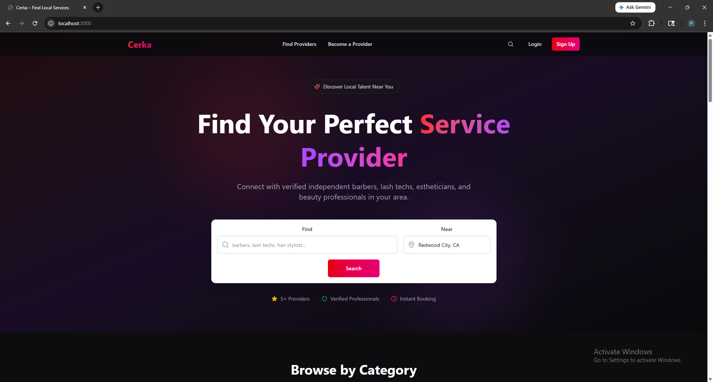
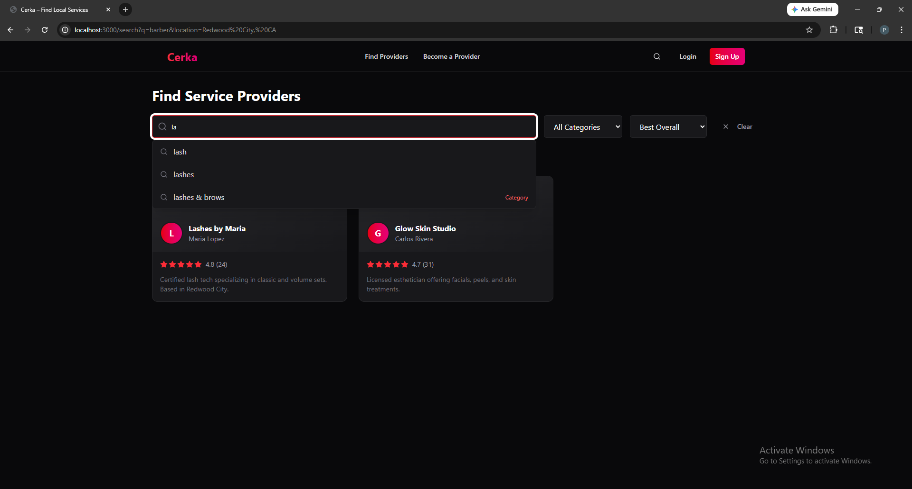
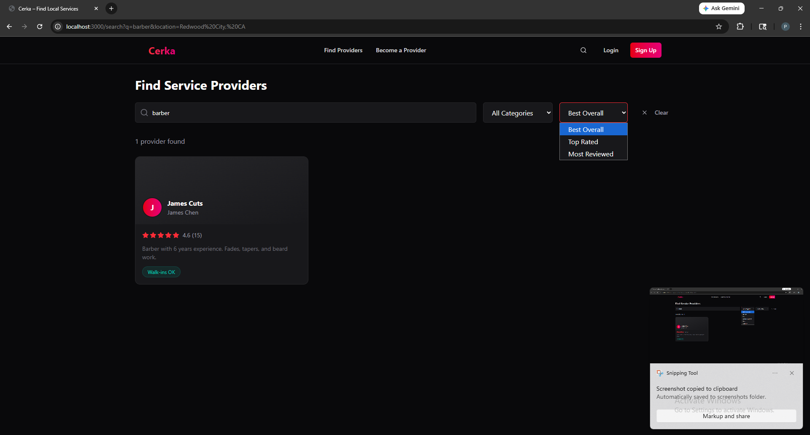
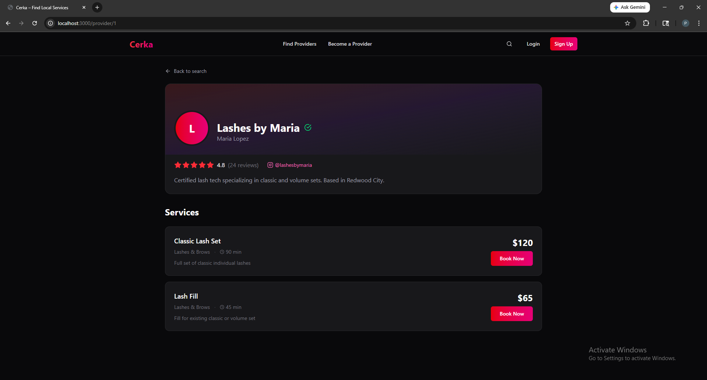

# Cerka

A local services discovery platform that connects customers with independent service providers — the ones you find on Instagram, not Google.

## The Problem

Young entrepreneurs are building real businesses on Instagram — barbers, lash techs, nail artists, bakers, landscapers, florists. But discovering them is broken. If you move somewhere new and need a good barber, your only option is scrolling through DMs or hoping a friend knows someone. There's no central place to find, compare, and book these independent providers.

## The Solution

Cerka bridges that gap. Providers create profiles linked to their Instagram, list their services and pricing, and show up in location-based search results. Customers can discover, compare, and book — all in one place.

While the current focus is beauty and personal care (barbers, lash techs, estheticians, nail artists), the platform is designed to scale to any Instagram-driven service: landscaping, catering, desserts, event decorations, and more.

## Tech Stack

- **Frontend:** React (Vite) with Tailwind CSS
- **Backend:** Java Spring Boot
- **Database:** PostgreSQL
- **Auth:** Google OAuth 2.0 via Spring Security
- **Architecture:** RESTful API with Controller → Repository → Model pattern

## Screenshots

### Landing Page


### Search with Trie Autocomplete


### Heap-Powered Sort Modes


### Provider Profile


## Data Structures & Algorithms

This project intentionally applies DSA concepts in a production context:

### Trie — Autocomplete Search
A custom prefix tree enables instant search suggestions as users type. Built from scratch in `client/src/lib/trie.js`.
- O(m) prefix lookup where m = query length
- Each node uses a Map for O(1) character lookup
- Preloaded with service keywords and dynamically updated with categories from the database

### Levenshtein Distance — Fuzzy Search
When the Trie finds no exact prefix match, a fuzzy search kicks in using edit-distance calculation. If a user misspells "baber", it still suggests "barber" (1 edit away). Uses dynamic programming with a 2D matrix to compute minimum edits (insertions, deletions, substitutions).

### MaxHeap — Provider Ranking
A custom max heap ranks providers using a weighted scoring formula rather than raw rating alone. Built from scratch in `client/src/lib/heap.js`.

**Scoring formula:**
```
score = (avg_rating × 10) + (log(total_reviews + 1) × 2) + (accepts_walkins ? 1 : 0)
```

This means a provider with 4.8 stars and 50 reviews ranks higher than one with 5.0 stars and 1 review. Users can switch between ranking modes: Best Overall, Top Rated, and Most Reviewed.

The heap accepts a custom comparator function, making it reusable across different ranking strategies. Insert and extract operations run in O(log n).

## Database Schema

PostgreSQL with 18+ entities and 22+ relationships, demonstrating normalization patterns:
- **One-to-one:** Users ↔ Service Providers
- **One-to-many:** Providers → Services
- **Many-to-many:** Services ↔ Tags (via junction table)

Key tables: `users`, `customers`, `service_providers`, `business_profiles`, `services`, `categories`, `appointments`, `reviews`, `availability_schedules`, `service_areas`

## Security

- Google OAuth 2.0 for authentication (no password storage)
- Parameterized SQL queries to prevent SQL injection
- CORS configured to restrict API access to the frontend origin
- Credentials excluded from version control via `.gitignore`

## Project Structure

```
cerka-v2/
├── client/                    # React frontend (Vite)
│   └── src/
│       ├── components/        # Reusable UI components
│       ├── lib/               # DSA implementations (Trie, MaxHeap)
│       ├── pages/             # Landing, Search, ProviderProfile
│       ├── services/          # API client
│       └── styles/            # Global styles
├── server-java/               # Spring Boot backend
│   └── src/main/java/com/cerka/
│       ├── config/            # CORS, Jackson, Security, OAuth
│       ├── controller/        # REST API endpoints
│       ├── model/             # Data models
│       └── repository/        # Database access layer
└── scripts/                   # SQL migration and seed scripts
```

## Running Locally

**Prerequisites:** Java 17+, Maven, Node.js 18+, PostgreSQL

1. **Database setup:**
```bash
createdb cerka_dev
psql cerka_dev < scripts/001_create_tables.sql
psql cerka_dev < scripts/002_seed_data.sql
```

2. **Backend:**
```bash
cd server-java
# Add application.properties with your PostgreSQL and Google OAuth credentials
mvn spring-boot:run
```

3. **Frontend:**
```bash
cd client
npm install
npx vite --port 3000
```

The app will be available at `http://localhost:3000`.

## Author

**Brandon Sanchez** — [GitHub](https://github.com/Bsanchez650)